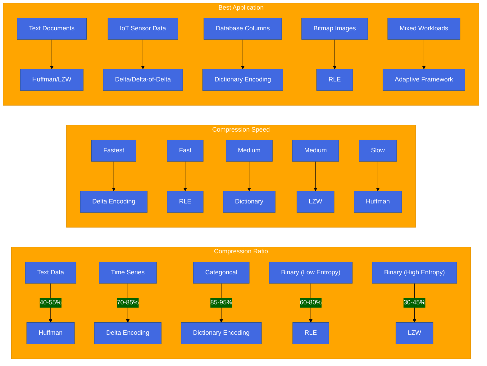

```mermaid
%%{init: {'theme': 'base', 'themeVariables': { 'primaryColor': '#4169E1', 'primaryTextColor': '#fff', 'primaryBorderColor': '#2F528F', 'secondaryColor': '#006100', 'secondaryTextColor': '#fff', 'secondaryBorderColor': '#003F00', 'tertiaryColor': '#FFA500', 'tertiaryTextColor': '#fff', 'tertiaryBorderColor': '#DB8C00' }}}%%
graph LR
    subgraph "Compression Ratio"
        CR1["Text Data"] --> |"40-55%"| HF1["Huffman"]
        CR2["Time Series"] --> |"70-85%"| DE1["Delta Encoding"]
        CR3["Categorical"] --> |"85-95%"| DI1["Dictionary Encoding"]
        CR4["Binary (Low Entropy)"] --> |"60-80%"| RL1["RLE"]
        CR5["Binary (High Entropy)"] --> |"30-45%"| LW1["LZW"]
    end
    subgraph "Compression Speed"
        CS1["Fastest"] --> DE2["Delta Encoding"]
        CS2["Fast"] --> RL2["RLE"]
        CS3["Medium"] --> DI2["Dictionary"]
        CS4["Medium"] --> LW2["LZW"]
        CS5["Slow"] --> HF2["Huffman"]
    end
    subgraph "Best Application"
        BA1["Text Documents"] --> HF3["Huffman/LZW"]
        BA2["IoT Sensor Data"] --> DE3["Delta/Delta-of-Delta"]
        BA3["Database Columns"] --> DI3["Dictionary Encoding"]
        BA4["Bitmap Images"] --> RL3["RLE"]
        BA5["Mixed Workloads"] --> AD["Adaptive Framework"]
    end
```