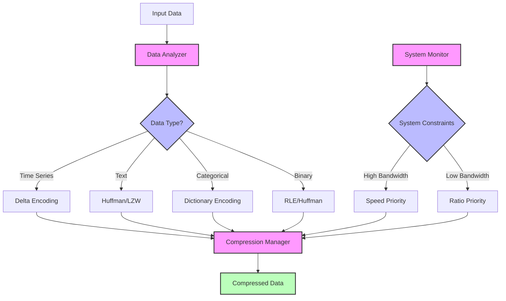

```mermaid
graph TD
    A[Input Data] --> B[Data Analyzer]
    B --> C{Data Type?}
    C -->|Time Series| D[Delta Encoding]
    C -->|Text| E[Huffman/LZW]
    C -->|Categorical| F[Dictionary Encoding]
    C -->|Binary| G[RLE/Huffman]
    
    H[System Monitor] --> I{System Constraints}
    I -->|High Bandwidth| J[Speed Priority]
    I -->|Low Bandwidth| K[Ratio Priority]
    
    D --> L[Compression Manager]
    E --> L
    F --> L
    G --> L
    J --> L
    K --> L
    
    L --> M[Compressed Data]
    
    classDef process fill:#f9f,stroke:#333,stroke-width:2px;
    classDef decision fill:#bbf,stroke:#333,stroke-width:2px;
    classDef output fill:#bfb,stroke:#333,stroke-width:2px;
    
    class B,H,L process;
    class C,I decision;
    class M output;
```