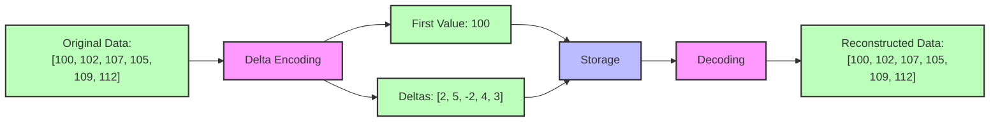

```mermaid
graph LR
    A["Original Data:
    [100, 102, 107, 105, 109, 112]"] --> B["Delta Encoding"]
    
    B --> C["First Value: 100"]
    B --> D["Deltas: [2, 5, -2, 4, 3]"]
    
    C --> E["Storage"]
    D --> E
    
    E --> F["Decoding"]
    
    F --> G["Reconstructed Data:
    [100, 102, 107, 105, 109, 112]"]
    
    classDef process fill:#f9f,stroke:#333,stroke-width:2px;
    classDef data fill:#bfb,stroke:#333,stroke-width:2px;
    classDef storage fill:#bbf,stroke:#333,stroke-width:2px;
    
    class B,F process;
    class A,C,D,G data;
    class E storage;
```