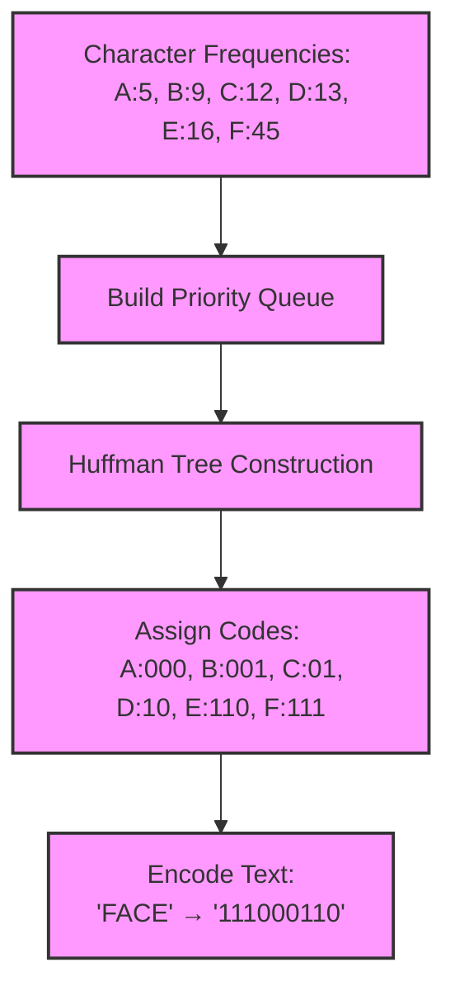

```mermaid
graph TD
    A["Character Frequencies: 
    A:5, B:9, C:12, D:13, E:16, F:45"]
    
    A --> B["Build Priority Queue"]
    
    B --> C["Huffman Tree Construction"]
    
    C --> D["Assign Codes: 
    A:000, B:001, C:01, D:10, E:110, F:111"]
    
    D --> E["Encode Text: 
    'FACE' → '111000110'"]
    
    classDef process fill:#f9f,stroke:#333,stroke-width:2px;
    class A,B,C,D,E process;
```